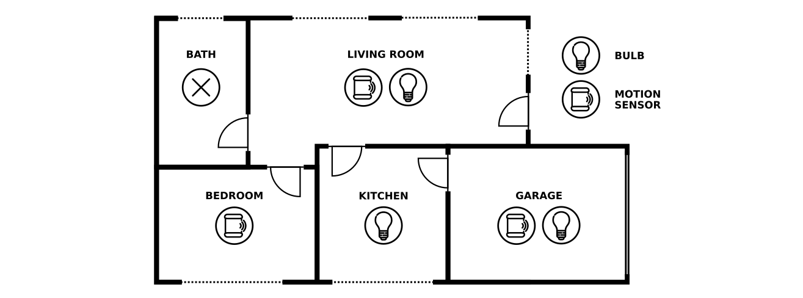

# KAAF
In a nutshell, KAAF aims to be a system capable of processing information and knowledge about how the world works (user habits, general facts like _fire burns_, etc.), general human intentions and needs and specific contexts to, through commonsense reasoning processes, deduce, define, monitor and update the automation rules that drive the behaviour of Smart Home systems, normally defined manually by users. The name of the system is derived from a three-layered knowledge management system in which **K**nowledge is defined for the creation of **A**utonomous **A**utomations that determine the system functioning when concrete **F**acts (that trigger the rules) are deduced from the events captured from the environment.

# What can you find in this repo?
This repository shows the KAAF system in a very early stage of development. It is provided a basic implementation of KAAF for Smart Home lighting problems, as a proof of concept. The material used is the following: 

- An implementation of KAAF in Python: `kaaf.py`
- The knowledge model used to enable commonsense reasoning about lighting problems, located in `scone-knowledge.d/`
- A set of tests to ensure the correctness of the implementation, in `test/`
- Context information about a concrete scenario, the use case: `usecase.scenario`
- A Home Assistant setup to visualise the automations generated by KAAF, in `ha/`

## The use case
For this example, only motion sensor and smart light bulb devices have been considered. The existence of windows is important too to determine if it must be taken into account the hour or the moment of the day to trigger an action. The scenario, which specification is included in `usecase.scenario`, is illustrated in this figure:



In this case, the commonsense knowledge modelled enables the generation of automation rules to turn on the light when there is someone in a room. This is done when it is assumed that there is not enough light, i.e., at night or when the room has not natural light during the day. The rules are generated when the required devices are available. According to that, the automations defined for the given scenario are the following:

|    |                                            |   |                              |
|---:|-------------------------------------------:|:-:|:-----------------------------|
| r1 | *occupancy_event_from(living_room_sensor)* | → | *occupied_room(living_room)* |
| r2 | *occupied_room(living_room) ∧ night*       | → | *turn_on(living_room_bulb)*  |
| r3 | *occupancy_event_from(bedroom_sensor)*     | → | *occupied_room(bedroom)*     |
| r4 | *occupied_room(kitchen) ∧ night*           | → | *turn_on(kitchen_bulb)*      |
| r5 | *occupancy_event_from(garage_sensor)*      | → | *occupied_room(garage)*      |
| r6 | *occupied_room(garage)*                    | → | *turn_on(garage_bulb)*       |

In rooms with motion sensors and bulbs two rules are generated: one to create a fact that means someone is in the room when an occupation event is captured (*r1*, *r3* and *r5*) and another one to turn on the light when this happens (*r2*, *r3* and *r4*). In the case of the kitchen, for example, only the rule to turn on the light is created, while in the case of the bedroom, the automation rule defined is the occupancy rule. This is done in this manner because, although a bulb can not be turned on in these scenes, the occupancy information generated can be used to feed the system with other purposes, and the performing of the action to turn on the light can be triggered by facts from other inference processes.

## Running the example
To generate the automation rules for the scenario described above, the commonsense knowledge model is loaded in a Scone instance. Then, KAAF is executed to make the required queries in the rule generation process. Finally, a list with the automation rules is provided.

Add the [ARCO deb-package repository](https://uclm-arco.github.io/debian/) to your *sources.list* and install the following dependencies:

- scone-server
- scone-wrapper
- python3-zeroc-ice

Run the example with:

```
$ make
```
